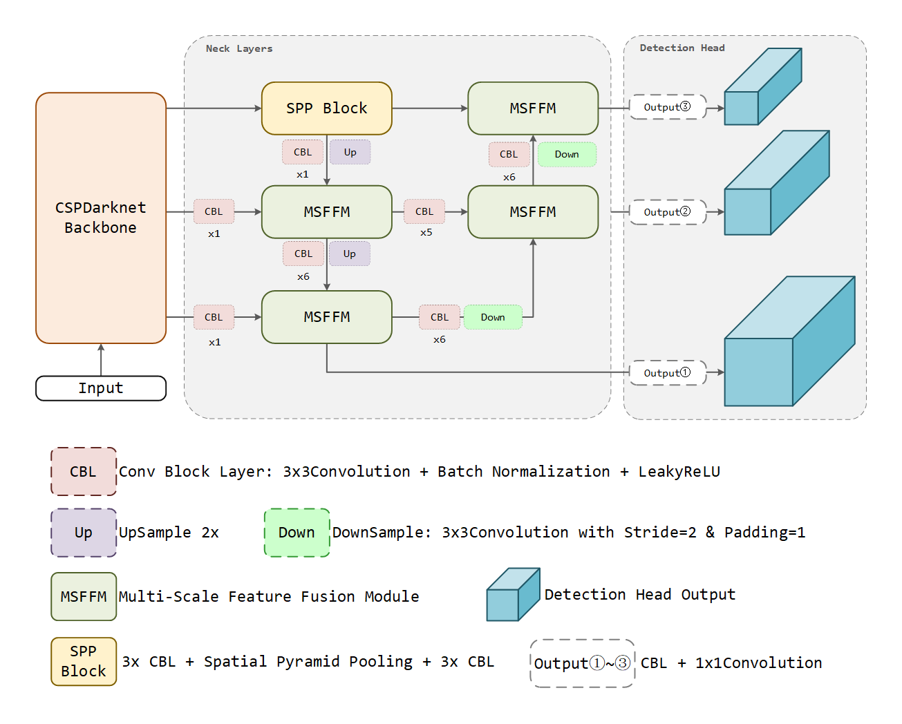

# AstroYOLO: A CNN and Transformer Hybrid Deep Learning Object Detection Model for Blue Horizontal-branch Stars



## Environment

> - Ubuntu Server 22.04 LTS
>  - Python 3.10.8
>  - CUDA 11.7
>  - CUDNN 8.5

Create a new conda environment and install the required packages:

```shell
conda create -n astro_yolo python=3.10
conda activate astro_yolo
pip3 install torch torchvision torchaudio
pip3 install astropy reproject opencv-python matplotlib scipy scikit-learn tqdm tensorboard tensorboardX torchinfo
```

Before training, check the `config/model_config.py` file to set your training configuration.

## Data Preparation

The dataset file structure is following the VOC2007 dataset format, the dataset directory should be like this: (
e.g. `dataset_example/dataset`)

```
├── dataset
│   ├── VOCdevkit
│   │   ├── VOC2007
│   │   │   ├── Annotations
│   │   │   │   ├── annotation_1.xml
│   │   │   │   ├── annotation_2.xml
│   │   │   │   ├── ...
│   │   │   ├── ImageSets
│   │   │   │   ├── Main
│   │   │   │   │   ├── train.txt
│   │   │   │   │   ├── valid.txt
│   │   │   │   │   ├── test.txt
│   │   │   ├── JPEGImages
│   │   │   │   ├── dataset_image_1.npy
│   │   │   │   ├── dataset_image_2.npy
│   │   │   │   ├── ...
│   ├── train_annotation.txt
│   ├── valid_annotation.txt
│   ├── test_annotation.txt
```

Input images should be in the `.npy` format, include 3 channels. (e.g. `i, r, g`)
